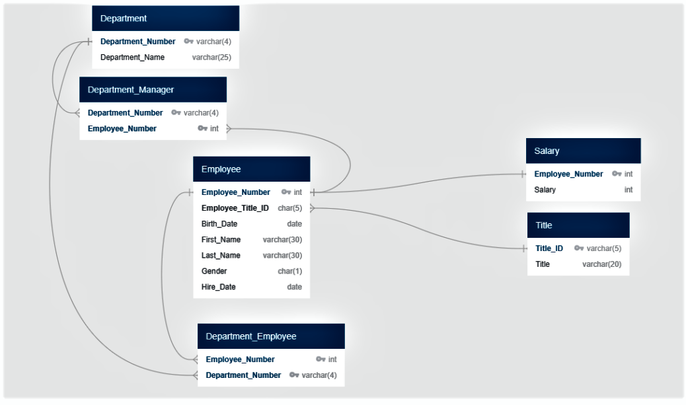

# sql-challenge - Employee Database: A Mystery in Two Parts

# SQL Postgress / SQLAlchemy  

## Overview

This is the SQL Homework submission for: Employee Database: A Mystery in Two Parts 

* Included in this is a main folder EmployeeSQL with 3 subfolder: 
   
  * Code: contains SQL for creating the tables and the 8 requested queries.  Also contains Jupyter notebook for the Bonus analysis. Added an "Extra" item where the 31,579 duplicate employee entries in the department_employee table were investigated.

  * Documenation: Word Document with the ERD created in QuickDBD, schema exported from QuickDBD, Word Document with screen shots of Query output, and Screen Shot Image of the ERD

  * Data: the 6 csv files loaded into the 6 database tables  
  

## Files

* [Code:](EmployeeSQL/Code)  

  * [Schema for creating tables](EmployeeSQL/Code/EmployeeSQL_Schema.sql)- creates 6 tables, adds primary and foreign keys, adds contraints for no nulls and uniqness.

  * [Queries of the data](EmployeeSQL/Code/EmployeeSQL_Queries.sql)- 8 queries as requested. Description if in the comments before and results are captured in the query output document. 

  * [Bonus Jupyter Notebook](EmployeeSQL/Code/EmployeeSQL_Bonus.ipynb) - sets up SQLAlchemy engine connection, reads from the Postgress database into Pandas and produces graphs and reports. 

  * [Extra Work - Duplicate Department_Employee Query](EmployeeSQL/Code/Duplicate_Staff_Entries_Analysis.sql) - looked at the fact that there are 31,579 duplicate employee numbers in the department_Employee table.  Appears to be that there are dups because when people are promoted / move departments the old entries are not removed.  Best practice would be to add a start-date, and also to record the end date when they leave or move onto a new department.  This would also apply to the titles and salary tables, but appears they only have one entry. 

* [Documentation:](EmployeeSQL/Documentation)
  
  * [Entity Relationship Diagram Document](EmployeeSQL/Documentation/ERD_Diagram_from_QuickDBD_for_EmployeeSQL-SQL_Challenge.docx) - word doc

  * [Query Output](EmployeeSQL/Documentation/Query_Output_for_EmployeeSQL-SQL_Challenge.docx) - Screen Shots of the queries and output in Postgress

  * [ERD Diagram image](EmployeeSQL/Documentation/EmployeeSQL-ERD_Image.png) - ERD (also shown below)

  * [QuickDBD Schema](EmployeeSQL/Documentation/Schema_Exported_from_QuickDBD-EmployeeSQL-SQL_Challenge.sql) - Sample of exported schema based on ERD, has some issues...just an example
  
	
* [Data](EmployeeSQL/Data) - 6 CSVs used for loading the tables. 

  
## Diagram

* ERD Diagram for the Employee Database

